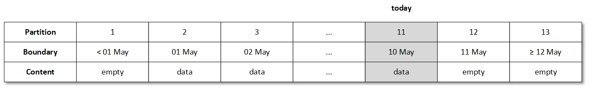
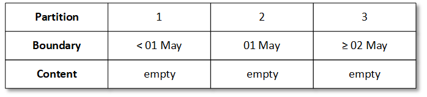
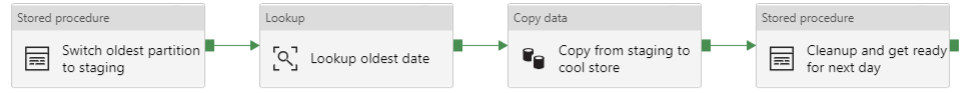

> This branch illustrates how to move data from one (hot) database to another (warm) one. If you prefer offloading data to a blob store, check the [blob-archive](https://github.com/meken/sql-partitioned-tables/tree/blob-archive) branch.

# Partitioned tables with a sliding window

Azure SQL Database supports horizontal partitioning of table data for manageability and performance benefits as
explained in the [docs](https://docs.microsoft.com/en-us/sql/relational-databases/partitions/partitioned-tables-and-indexes?view=azuresqldb-current).
Although most of this capability is explained and documented in various places (see the [related content](https://docs.microsoft.com/en-us/sql/relational-databases/partitions/partitioned-tables-and-indexes?view=azuresqldb-current#related-content) in the docs),
this repository attempts to demonstrate how to work with partitioned tables and sliding windows using Azure
resources for a specific example scenario.

## The scenario

In this example scenario we'll be designing a solution that consists of two data stores. One _hot_ data store for
keeping the most recent data, and a _warm_ data store for archival purposes. Depending on the requirements of your
solution you can choose from different storage options, but for this example we'll consider RDMBSs for both data stores,
albeit using different tiers for cost/performance optimizations.

## The solution architecture

The chosen architecture is basically using two Azure SQL Databases. First one, used as the hot data store, is a
Business Critical Azure SQL Database with up to 4TB storage, and the second one, for the warm data store, is a
Hyperscale Azure SQL Database with up to 100TB storage. The idea is that the first data store keeps the data in a
daily partitioned table, for N days, and at the end of the N days, the oldest partition is copied to the warm store
using Azure Data Factory.

As the title of this document indicates, we'll be partitioning the data, at least in the hot data store. The main
purpose of this partitioning is to simplify the archival process and make sure that it doesn't put any
unreasonable load on the underlying system during the process.

> Azure SQL Database only supports the FULL recovery model (see [docs](https://docs.microsoft.com/en-us/azure/sql-database/sql-database-features)).
> As a result bulk deletes (such as removing a whole day worth of data) can fill up the log space
> and slow down the database. Partition switching circumvents this problem.

The whole process consists of a number of steps, all orchestrated through Azure Data Factory and Stored Procedures.
Once the partitioned table reaches the maximum size, the oldest partition is _switched_ to a staging table, which
basically removes the whole partition (worth one day of data) from the source table and _inserts_ it into the
empty staging table (which is also partitioned). This is pretty quick and efficient as it's actually a meta-data
operation. Next step is to copy all the data from the staging table to the warm store. And when the copy is complete
the staging table is truncated, getting ready for the next day.

## The implementation

In order to simplify things, we'll be assuming that the data is in a single table `orders`, which has a clustered
index on `customer_id` and `order_date` columns. The `order_date` will be used for partitioning, and the
table won't have any other indexes as all reads happen through `customer_id` column and we want to keep the
indexes to a minimum to ensure that writes are lightning quick in the hot data store.

In this example we'll be keeping the data in the hot data store for 10 days before it gets copied to the warm store.
So, we'll have to have at least 10 partitions in the hot table. However, in order to minimize expensive data movement
during partition maintenance of a sliding window, it's recommended to keep the first and the last partitions empty. That
leads to two more partitions at the both ends of the date range. In addition, we'll be probably doing the
partition switching nightly, and to ensure that we have an empty partition at all times, as at night we're
already storing data in tomorrow's partition, we'll add another partition as a buffer. So, we end up with 13 partitions.

> In order to define the partitions we'll specify the partition boundaries. Keep in mind that the total number of
> partitions is the number of boundaries *plus* 1.

Let's assume that today is 10th of May and we'd like to keep the last 10 days worth of data (including today). This
would require us to have the following structure.



Partitioning a table is a three step process, we first need to define a partition function to define the partition
boundaries, followed by a partition scheme to map partitions to filegroups and then apply the partition scheme to
the table.

### The partition function

Given the assumptions laid above, we can define the partition function as follows.

```SQL
CREATE PARTITION FUNCTION pf_daily(datetime2)
AS RANGE RIGHT FOR VALUES (
    '20200501',
    '20200502',
    ...
    '20200512');
```

Note if you need to create many partitions you can either build a script in your favourite language or do it in
T-SQL.

```SQL
DECLARE @ndays int = 10;
DECLARE @today datetime2 = '20200510';
DECLARE @curr datetime2 = DATEADD(DAY, -@ndays+1, @today);
-- two more boundary values, for the buffer and the end
DECLARE @end datetime2 = DATEADD(DAY, 2, @today);

DECLARE @sql nvarchar(max) =
    N'CREATE PARTITION FUNCTION pf_daily (datetime2)
    AS RANGE RIGHT FOR VALUES (';

WHILE @curr < @end
BEGIN
    SET @sql += '''' + CAST(@curr as nvarchar(10)) + '''' + N', ';
    SET @curr = DATEADD(DAY, 1, @curr);
END

SET @sql += '''' + CAST(@curr as nvarchar(10))+ '''' + N');';

EXEC sp_executesql @sql
```

> As you might have noticed we're using the `datetime2` data type for dates, if you're curious about the
> differences between `datetime` and `datetime2`, have a look at the
> [docs](https://docs.microsoft.com/en-us/sql/t-sql/data-types/datetime2-transact-sql?view=azuresqldb-current)

The ranges defined above use the `RANGE RIGHT` option, this makes sure that you're providing the
_lower_ boundary for your partitions. `RANGE LEFT` on the other hand would set the _upper_ boundaries, and
that's usually more tricky to use with dates.

Now we've got a partition function, let's define the partition scheme.

### The partition scheme

Next step is to create the partition scheme that maps the partition to a file group. Since on Azure SQL Database
only primary file groups are supported, the scheme is rather trivial.

```SQL
CREATE PARTITION SCHEME ps_daily
AS PARTITION pf_daily ALL TO ([PRIMARY]);
```

Now we have the partition scheme and function set up, we can create the table and apply the partititoning function.

### The partitioned table

This is pretty trivial as well, all we need to do is to apply the partition scheme to the the proper partition
column when creating the table.

```SQL
CREATE TABLE orders (
    [customer_id] BIGINT NOT NULL,
    [order_date] DATETIME2(7) NOT NULL,
    [order_amount] BIGINT NOT NULL DEFAULT 0,
    [product_id] BIGINT NOT NULL,
    ...
    [order_code] VARCHAR(32) NULL,
    PRIMARY KEY ([customer_id], [order_date])
) ON ps_daily([order_date]);
```

After having created the table, we can start inserting the data. If you're interested in best practices around how
to bulk insert data into a partitioned table, see this [article](https://docs.microsoft.com/en-us/previous-versions/sql/sql-server-2005/administrator/cc966380(v=technet.10)?redirectedfrom=MSDN)

Once the partitions are (almost) full, the archival process can be started. As mentioned earlier, we'll be using a
staging table for the process. In order to utilize the benefits of partitioning, we'll need to make sure that this
staging table is also partitioned using aligned boundaries.

### The staging table

The staging table is very similar to the source table, the only difference is that it will have at most 1 partition
filled. This leads to three partitions (an empty partition at both ends, plus the data partition) and hence
2 boundaries.

For our example where we keep 10 days worth of data up to 10th of May, this gives the following boundaries.

```SQL
CREATE PARTITION FUNCTION pf_daily_staging(datetime2)
AS RANGE RIGHT FOR VALUES (
    '20200501',
    '20200502');
```

If you'd like to define that programmatically, you could do that in T-SQL.

```SQL
DECLARE @ndays int = 10;
DECLARE @today datetime2 = '20200510';
DECLARE @first datetime2 = DATEADD(DAY, -@ndays+1, @today);
DECLARE @second datetime2 = DATEADD(DAY, 1, @first);

DECLARE @sql nvarchar(max) =
    N'CREATE PARTITION FUNCTION pf_daily_staging (datetime2)
    AS RANGE RIGHT FOR VALUES (';

SET @sql += '''' + CAST(@first as nvarchar(10))+ '''' + N', ';
SET @sql += '''' + CAST(@second as nvarchar(10))+ '''' + N');';

EXEC sp_executesql @sql
```

Given these boundaries the empty staging table would have the following structure.



Having a partition function only is not sufficient, we also need to define a partition scheme and apply the staging
partition scheme to the staging table which will have the same structure as the source table.

The partition scheme.

```SQL
CREATE PARTITION SCHEME ps_daily_staging
AS PARTITION pf_daily_staging ALL TO ([PRIMARY]);
```

And now the staging table.

```SQL
CREATE TABLE orders_staging (
    [customer_id] BIGINT NOT NULL,
    [order_date] DATETIME2(7) NOT NULL,
    [order_amount] BIGINT NOT NULL DEFAULT 0,
    [product_id] BIGINT NOT NULL,
    ...
    [order_code] VARCHAR(32) NULL,
    PRIMARY KEY ([customer_id], [order_date])
) ON ps_daily_staging([order_date]);
```

### The switch

Assuming that everything is set up properly and the partitions are aligned, all we need to do is to switch the second
partition (the first non-empty partition) from the source table to the staging table.

```SQL
ALTER TABLE orders
SWITCH PARTITION 2
TO orders_staging PARTITION 2;
```

After having done this, the corresponding partition in the source table becomes empty and the staging table can be
used to copy the data to the warm data store. For this purpose we can use Azure Data Factory and that will be
illustrated in the orchestration section of this document.

If you need to get an overview of how the data is distributed over different partitions, you can use the following
T-SQL which combines data from various dynamic management views.

```SQL
SELECT
    OBJECT_NAME(pstats.object_id) AS table_name,
    prv.value AS boundary_value,
    pstats.partition_number AS partition_number,
    pstats.row_count AS row_count
FROM sys.dm_db_partition_stats AS pstats
    INNER JOIN sys.partitions AS p ON pstats.partition_id = p.partition_id
    INNER JOIN sys.destination_data_spaces AS dds ON pstats.partition_number = dds.destination_id
    INNER JOIN sys.partition_schemes AS ps ON dds.partition_scheme_id = ps.data_space_id
    INNER JOIN sys.partition_functions AS pf ON ps.function_id = pf.function_id
    INNER JOIN sys.indexes AS i ON pstats.object_id = i.object_id
        AND pstats.index_id = i.index_id
        AND dds.partition_scheme_id = i.data_space_id
        AND i.type <= 1 /* Heap or Clustered Index */
    LEFT JOIN sys.partition_range_values AS prv ON pf.function_id = prv.function_id
        AND pstats.partition_number =
            (CASE pf.boundary_value_on_right WHEN 0 THEN prv.boundary_id ELSE (prv.boundary_id+1) END)
ORDER BY table_name, partition_number
```

### The cleanup

After completing the copy of the data, we can empty the staging table and get ready for the next day. This requires
to add new partitions to both tables (source and staging) at the end, and merge the first partitions to basically
remove them. And finally we can truncate the staging table, so we end up again with an empty table for the next day.

```SQL
DECLARE @oldest datetime2 = CAST(
    (SELECT TOP 1 [value] FROM sys.partition_range_values
        WHERE function_id = (
            SELECT function_id FROM sys.partition_functions
               WHERE [name] = 'pf_daily'
            )
        ORDER BY boundary_id
    ) AS datetime2)

DECLARE @latest datetime2 = CAST(
    (SELECT TOP 1 [value] FROM sys.partition_range_values
        WHERE function_id = (
            SELECT function_id FROM sys.partition_functions
               WHERE [name] = 'pf_daily'
            )
        ORDER BY boundary_id DESC
    ) AS datetime2)

-- source table, add new partition and remove oldest one
SET @srcnew = DATEADD(DAY, 1, @latest)

ALTER PARTITION SCHEME ps_daily
NEXT USED [PRIMARY];

ALTER PARTITION FUNCTION pf_daily()
SPLIT RANGE (@srcnew);

ALTER PARTITION FUNCTION pf_daily()
MERGE RANGE (@oldest);

-- staging table, add new partition and remove oldest one
SET @stgnew = DATEADD(DAY, 2, @oldest)

ALTER PARTITION SCHEME ps_daily_staging
NEXT USED [PRIMARY];

ALTER PARTITION FUNCTION pf_daily_staging()
SPLIT RANGE (@stgnew);

ALTER PARTITION FUNCTION pf_daily_staging()
MERGE RANGE (@oldest);

TRUNCATE TABLE orders_staging;
```

Now we've documented all the steps, we can put the workflow together in the next section.

## The orchestration

We'll be using Azure Data Factory to implement the workflow. In principle the whole flow consists of 3 simple steps
performed nightly; switching the oldest (non-empty) partition from the source table to the staging table, copying from
the staging table to the warm data store and finally preparing for the next day by altering the partition function
(adding and merging boundaries) for both source and staging tables before cleaning up the staging table.



The details of the workflow can be found in the ARM template, that includes the references to the data stores, data
sets, the pipeline as well as a scheduled trigger for running the pipeline on a daily basis.

## Automation

This repository includes a Github actions pipeline for automating the whole setup. The pipeline creates all of the
required resources, such as the databases, data factory for orchestration and the data factory pipeline. As part of the
build process, all tables and their corresponding attributes (partition schemes/functions & random data) are added in
and idempotent fashion.

The steps are as follows:

1. Create the Azure SQL Databases and Azure Data Factory through ARM templates
2. Turn off the Azure SQL Database firewall for the build agent so that the SQL scripts can be executed
3. Create the tables and stored procedures in the hot data store
4. Create the tables in the warm data store
5. Add the Data Factory Managed Identity to both databases and assign the proper roles
6. Insert random data into the hot data store
7. Turn back on the Azure SQL Database firewall for the build agent
8. Deploy the Azure Data Factory Pipeline through ARM templates

### Azure Data Factory and its Managed Identity on Azure SQL Database

One of the challenges, that's addressed by the pipeline, is the automatic addition of the Data Factory Managed Identity
to the databases so that Azure Data Factory can execute its pipelines without any manual intervention and storing any
credentials. At the time of this writing the process of adding a managed identity (or any other Active Directory user) to an
Azure SQL Database is far from trivial. It requires an Active Directory user to be logged in to add an _external user_ (Managed
Identity or any other Active Directory user). Unfortunately, the service principal that's used for the build automation, cannot be
directly used for this purpose. So, the first step is to make sure that there's an Active Directory Group which includes the service
principal as a member, and then make that group the Active Directory admin user for the SQL Server. This at least allows the service principal to
log in as an Active Directory user, but it unfortunately isn't sufficient to add an _external user_ using the
[standard method](https://docs.microsoft.com/en-us/azure/sql-database/sql-database-aad-authentication-configure?tabs=azure-powershell#create-contained-database-users-in-your-database-mapped-to-azure-ad-identities). The next
step is the creation of a user object with some fields set to specific values, meaning that we need to calculate and
provide some specific information, namely the `SID` (Security Identifier). The `SID` is a binary field that's based on
the client id of the to be added Active Directory user, the Data Factory Managed Identity, which is a 16 byte GUID.
It's basically the (little endian) byte representation that's formatted as a hex string and passed as a literal to the
create user statement (believe me, I'm not making this up :confused:).
Another complexity is that Azure Data Factory Managed Identity only provides its object id (principal id),
so based on that, the client id must be looked up. As a consequence, the build service principal must have read
permissions to read from Active Directory to automate the whole thing.

```bash
DATA_FACTORY_OBJECT_ID=...  # get from the ARM template output
DATA_FACTORY_CLIENT_ID=`az ad sp show --id "$DATA_FACTORY_OBJECT_ID" --query appId -o tsv`
```

In the build pipeline a SQL query is used to convert the client id to the proper `SID` format, but you could do that
using various methods, see below for a python option.

```python
import uuid

DATA_FACTORY_CLIENT_ID=...  # pass as parameter or env variable
src = uuid.UUID(DATA_FACTORY_CLIENT_ID).bytes_le
print("0x" + "".join("{:02x}".format(b) for b in src)
```

Once all the information is prepared with respect to the managed identity, the service principal that's part of the
AD group that has been assigned as the admin for the SQL Server, needs to execute the create statements. Unfortunately,
the `sqlcmd` tool, used for running other SQL scripts in the pipeline, doesn't support authentication through service
principal credentials or access tokens. So, instead, a simple PowerShell script is used for connecting to the databases
and running the create user/grant permission statements.

```powershell
$ConnectionString = ...  # the connection string for the database without credentials
$Query = ... # query to run
$AccessToken = az account get-access-token --resource https://database.windows.net --query accessToken -o tsv

$Connection = New-Object System.Data.SqlClient.SqlConnection($ConnectionString)
$Connection.AccessToken = $AccessToken

$Connection.Open()
try {
    $SqlCmd = New-Object System.Data.SqlClient.SqlCommand($Query, $Connection)
    $SqlCmd.ExecuteNonQuery()
} finally {
    $Connection.Close()
}
```

## Summary

This repository should help you with

- Setting up a SQL Server Partitioned Table
- Configuring an Azure Data Factory Pipeline for copying data from one database to another one
- Adding the Azure Data Factory Managed Identity to an Azure SQL Database as an external user (in a headless fashion)
- Inserting random data into a database table efficiently
- Automating the whole setup in a Github Actions pipeline

In order to run the automation, you need to make sure that the build service principal

- has Contributor rights on the resource group
- is part of an existing Active Directory Group (which will become the admin for the logical Azure SQL Server)
- has read permissions on the Active Directory Graph (in order to lookup client id information from object ids)
